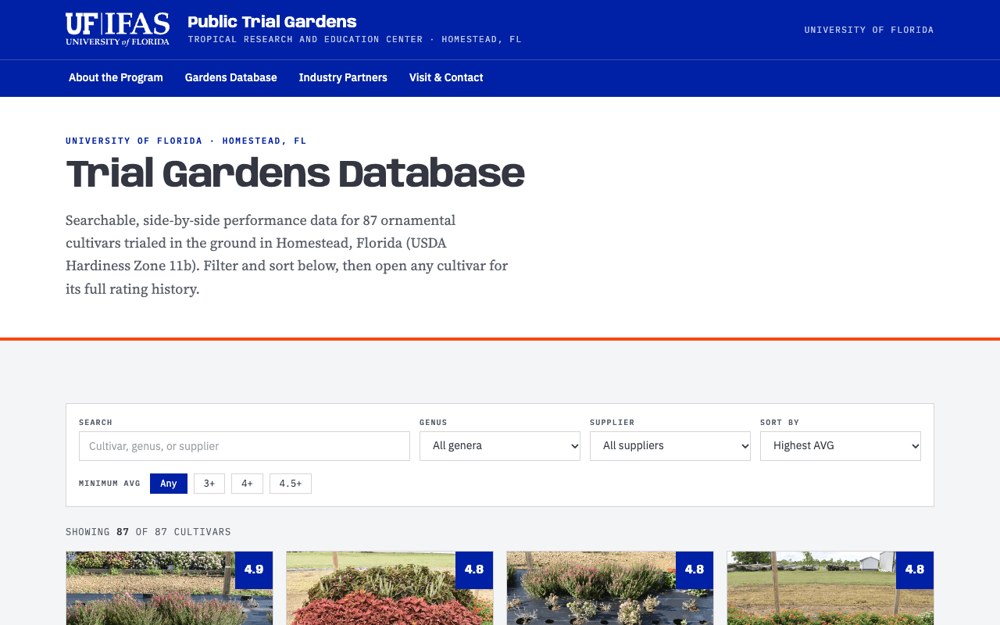
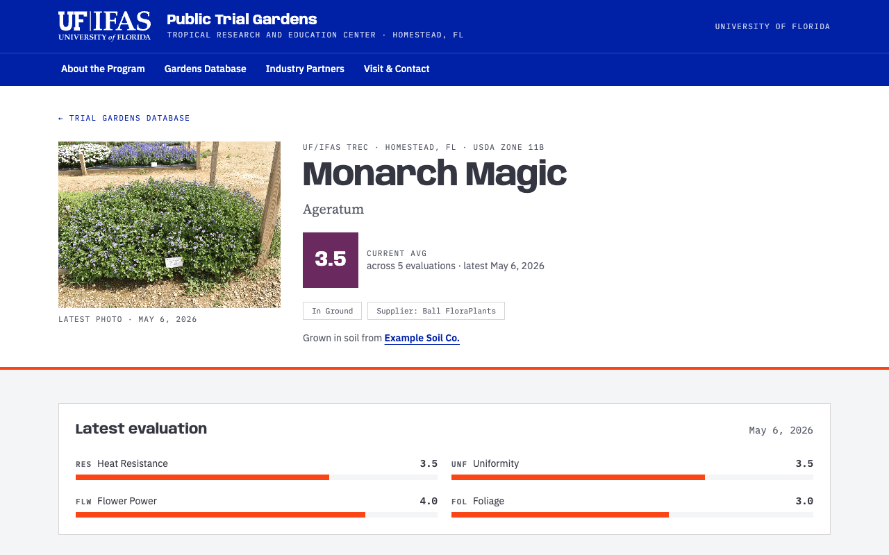
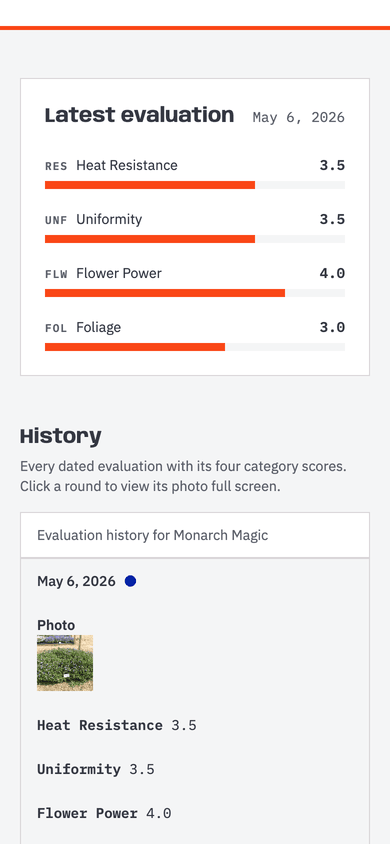
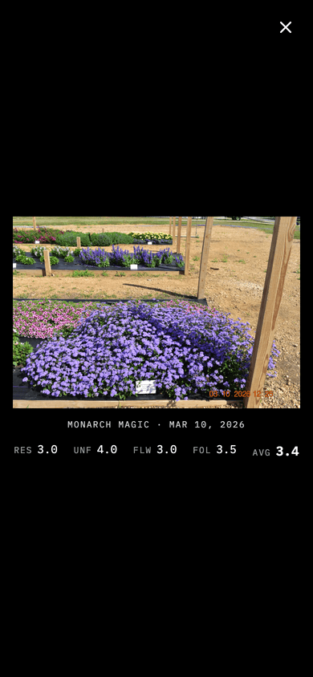

<div align="center">

# UF/IFAS Public Trial Gardens

**Searchable performance data for the ornamental cultivars trialed at the
UF/IFAS Tropical Research and Education Center in Homestead, Florida.**

[](https://github.com/dannyofmiami/uf-trial-gardens/actions/workflows/pages.yml)
[](https://github.com/dannyofmiami/uf-trial-gardens/actions/workflows/test.yml)
[](https://dannyofmiami.github.io/uf-trial-gardens/)
[](https://github.com/dannyofmiami/uf-trial-gardens/commits/main)
[](#mock-data)

[](https://nextjs.org/)
[](https://react.dev/)
[](https://www.typescriptlang.org/)
[](https://tailwindcss.com/)
[](https://nodejs.org/)

[**Live site**](https://dannyofmiami.github.io/uf-trial-gardens/) ·
[Deploy history](https://github.com/dannyofmiami/uf-trial-gardens/actions) ·
[Report an issue](https://github.com/dannyofmiami/uf-trial-gardens/issues)



</div>

> [!IMPORTANT]
> **The live site currently shows mock data scores, not real trial results.** The latest
> spreadsheet has no ratings entered yet, so the deploy builds with made-up scores
> (`npm run build:mock`) to demo the scoring features. See [Mock data](#mock-data) for
> how it works and how to switch back.

## Contents

- [About](#about)
- [Features](#features)
- [Quick start](#quick-start)
- [Commands](#commands)
- [Updating the data](#updating-the-data)
- [Mock data](#mock-data)
- [Deployment](#deployment)
- [Project structure](#project-structure)
- [Known issues and data gaps](#known-issues-and-data-gaps)
- [Contributing](#contributing)
- [License](#license)

## About

A static website for the UF/IFAS Public Trial Gardens, styled to the UF/IFAS web standard so
it matches [trec.ifas.ufl.edu](https://trec.ifas.ufl.edu). Every page is pre-rendered from a
JSON file built from the trial team's spreadsheet. There's no current database.

It's a proof of concept: it deploys to GitHub Pages today, with Azure Static Web Apps
(under UF's Microsoft infrastructure) planned for production.

## Features

- **Trial Gardens Database** — 87 cultivars with free-text search, genus and supplier
  filters, a minimum-average filter, and sorting by average, name or genus.
- **A page per cultivar** — current average, the latest round's four category scores, the
  supplier, and program sponsor credits.
- **History, one photo per round** — every evaluation date gets its own photo next to its
  scores. Click a row (or the main photo) to open it full screen with that round's
  scores.
- **Industry Partners** — every supplier in the trial with its entry count, average score
  and genera, generated from the data.
- **About** and **Visit & Contact** pages, including the 1–5 rating scale and an embedded map.

<table>
  <tr>
    <td width="70%"></td>
    <td width="15%"></td>
    <td width="15%"></td>
  </tr>
  <tr>
    <td align="center"><sub>Cultivar page</sub></td>
    <td align="center"><sub>History (mobile)</sub></td>
    <td align="center"><sub>Full-screen round (mobile)</sub></td>
  </tr>
</table>

## Quick start

**Prerequisites:** Node.js 22 and npm.

```bash
git clone https://github.com/dannyofmiami/uf-trial-gardens.git
cd uf-trial-gardens
npm install
npm run dev:mock    # http://localhost:3000 — with sample scores, like the live site
```

Use `npm run dev` instead to see the real data (every score shows as a dash until ratings
are entered).

## Commands

| Command | What it does |
|---|---|
| `npm run dev` | Dev server with the real data (`data/trials.json`) |
| `npm run dev:mock` | Dev server with sample scores (`data/trials.mock.json`) |
| `npm run build` | Static production build of the real data, to `out/` |
| `npm run build:mock` | Static production build with sample scores — **what the live site deploys today** |
| `npm test` | Build the deployed version, serve it with the Azure security headers, and run the browser tests (desktop + phone) |
| `npx tsc --noEmit` | Type-check the project (ESLint isn't set up yet, so `npm run lint` only offers to configure it) |
| `npm run import -- <file.xlsx>` | Rebuild `data/trials.json` from the trial spreadsheet |
| `npm run mock` | Regenerate `data/trials.mock.json` from `data/trials.json` |
| `npm run dropbox:auth` | One-time Dropbox sign-in; saves a refresh token to `.env.local` |
| `npm run dropbox:photos -- <file.xlsx>` | Download every round's photo from its Dropbox link and import it |
| `npm run photos -- <folder>... --date=YYYY-MM-DD` | Import photos from a folder you downloaded by hand |
| `npm run mirror` | Download *publicly* shared Dropbox links (rarely applicable; the trial links are private) |

## Updating the data

### 1. Import the spreadsheet

```bash
npm run import -- "../../data/InitiationData 2.xlsx"
```

The importer (`scripts/import-xlsx.mjs`) expects **one worksheet per evaluation date**, named
`MMDDYYYY`, with these columns:

`YEAR · Plant Name · GENUS · SUPPLIER · Uniformity · Flower Power · Foliage · Heat Resistance · Overall Rating · FLOWER COLOR · PLANT IMAGE 1`

`na` cells mean "not yet rated" and import as empty, not zero. If a value (for example a
supplier's name) changes on a later tab, the latest value wins. The import also flags any
Dropbox photo linked to more than one plant on the same date, writing the list to
`image-link-warnings.txt` next to the spreadsheet.

### 2. Download the photos

Each tab's `PLANT IMAGE 1` column links that round's photo, so photos are downloaded per
date, straight from each row's own link:

```bash
npm run dropbox:auth                                          # once
npm run dropbox:photos -- "../../data/InitiationData 2.xlsx"  # every time photos change
```

`dropbox:auth` needs a Dropbox app (created in the
[App Console](https://www.dropbox.com/developers/apps) with the `sharing.read` and
`files.content.read` permissions) and its key and secret in `.env.local`:

```bash
DROPBOX_APP_KEY=...
DROPBOX_APP_SECRET=...
```

Originals download to `../../data/dropbox-photos/` (outside the repo); resized 1400px and
480px WebP copies go to `public/plants/<cultivar>--<date>.webp`. Both Dropbox commands honor
`http_proxy` / `https_proxy` if your network needs a proxy. `.env.local` is git-ignored.

### 3. Sponsors

Program sponsors (soil, containers, …) aren't in the spreadsheet. List them in
`data/sponsors.json`, then re-run the import:

```json
[{ "credit": "Grown in soil from", "name": "Supplier Name", "url": "https://example.com/" }]
```

This can be expanded to include other sponsors.

## Mock data

The latest spreadsheet has no scores yet, so `npm run mock` builds `data/trials.mock.json`:
the real plants and photos with made-up scores and one placeholder sponsor.

> [!NOTE]
> **What's deployed:** `.github/workflows/pages.yml` runs **`npm run build:mock`**. Once the
> trial team enters real scores, re-run `npm run import`, then change that line back to
> `npm run build`. Re-run `npm run mock` after every real import so the sample copy keeps the
> same plants and photos.

## Deployment

Every push to `main` builds and deploys the site to
[GitHub Pages](https://dannyofmiami.github.io/uf-trial-gardens/) through
[`.github/workflows/pages.yml`](.github/workflows/pages.yml) (Node 22, `npm ci`, then
`npm run build:mock`). The workflow sets `NEXT_PUBLIC_BASE_PATH=/uf-trial-gardens` so links
and images work under the repo's sub-path. Changes reach `main` through pull requests.

**Planned: Azure Static Web Apps.** `staticwebapp.config.json` already sets the security
headers (CSP, HSTS, nosniff). To move hosting, create the Static Web App, store its deployment
token as the `AZURE_STATIC_WEB_APPS_API_TOKEN` repository secret, and add an Azure deploy
workflow.

## Project structure

```
app/                        routes (Next.js App Router), all statically exported
  page.tsx                  home
  about/                    program, methodology, rating scale
  trial-gardens/            searchable database
  trial-gardens/[id]/       one page per cultivar (87 generated)
  partners/                 suppliers, derived from the data
  visit/                    visit info, map, contact form
components/
  CultivarDetail.tsx        cultivar page: photo, scores, history table
  PhotoLightbox.tsx         full-screen photo viewer
  TrialPhoto.tsx            photo with thumbnail + placeholder fallback
  DatabaseBrowser.tsx       search, filters and sorting
lib/data.ts                 typed accessors over the trial data
data/
  trials.json               real data, generated by `npm run import` (committed)
  trials.mock.json          sample data, generated by `npm run mock` (committed)
  sponsors.json             program sponsors, edited by hand
scripts/
  import-xlsx.mjs           spreadsheet -> data/trials.json
  mock-data.mjs             data/trials.json -> data/trials.mock.json
  lib/derive.mjs            averages, awards, facets (shared by both)
  dropbox-auth.mjs          one-time Dropbox sign-in
  dropbox-photos.mjs        Dropbox links -> public/plants/
  import-photos.mjs         downloaded folder -> public/plants/
  relink-photos.mjs         re-attach photos already in public/plants/ after an import
public/plants/              resized trial photos, one per cultivar per date
docs/screenshots/           images used in this README
```

## Known issues and data gaps

- **No real scores yet.** All 435 evaluations in the latest spreadsheet are `na` — the reason
  the site deploys with [mock data](#mock-data).
- **Some photos are linked to the wrong plant.** 7 Dropbox files are each linked to more than
  one plant on the same date (listed in `image-link-warnings.txt` on every import). The fix
  belongs in the spreadsheet.
- **Flower color is empty** for all 87 cultivars, so there's no color filter yet.
- **No observation notes or weather** in the source data, though the data model has room for both.
- **The contact form is disabled** until it has a backend. Enabled without one, the browser
  would put visitors' details in the page URL, where host and CDN logs would record them.
- **Hosting size.** Photos total about 191 MB; Azure Static Web Apps' free tier caps a site at
  250 MB, so more rounds will need smaller images or separate photo storage.

## Contributing

1. Branch off `main` (`git switch -c short-descriptive-name`).
2. Run `npm run dev:mock` and check your change on desktop and mobile widths.
3. Run `npx tsc --noEmit` and `npm test`. The tests (in `tests/e2e/`) also run on GitHub for
   every pull request; first-time setup locally uses your installed Google Chrome.
4. Open a pull request into `main`; merging it deploys the site.

## License

No license has been chosen yet, which means all rights are reserved by default.
